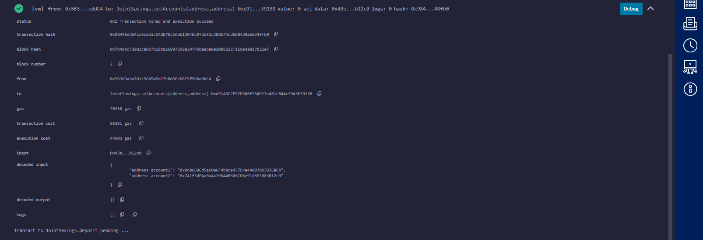
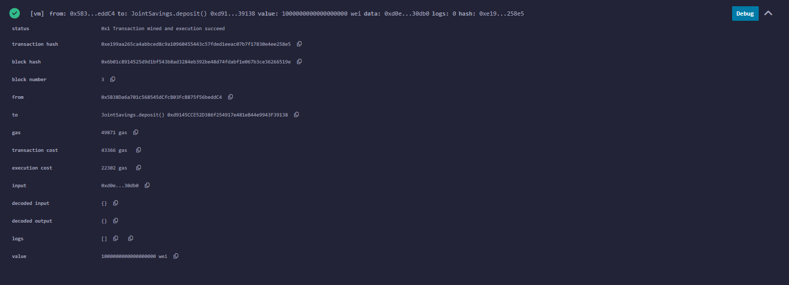
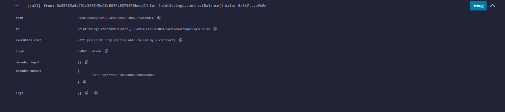
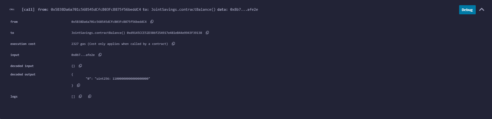
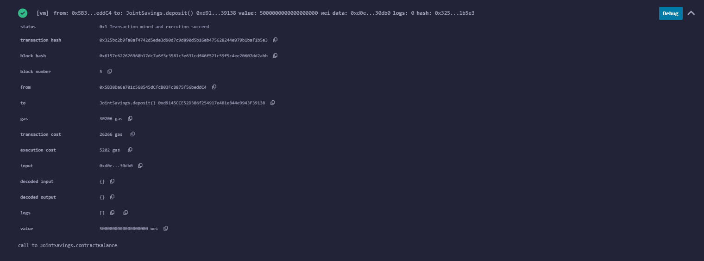
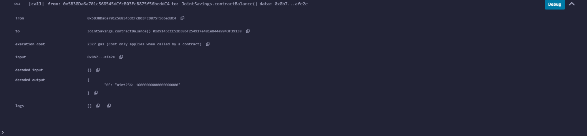

# Unit 20 - "Joint Savings Account"

## Table of Contents
- [Table of Contents](#table-of-contents)
- [Overview](#overview)
  * [Relevant Files](#relevant-files)
- [Steps Completed](#steps-completed)
  * [1. Create a Joint Savings Account Contract in Solidity](#1-create-a-joint-savings-account-contract-in-solidity)
  * [2. Compile and Deploy Contract in the JavaScript VM](#2-compile-and-deploy-contract-in-the-javascript-vm)
  * [3. Interact with Deployed Smart Contract](#3-interact-with-deployed-smart-contract)
- [Tech Stack](#tech-stack)

## Overview
I created a Solidity smart contract that accepts two user addresses, to automate the creation of joint savings accounts. These two addresses will be able to control a joint savings account. 

The smart contract uses ether management functions to implement a financial institution’s requirements for providing the features of the joint savings account. These features will consist of the ability to deposit and withdraw funds from the account.

### Relevant Files

See the file [joint_savings.sol](joint_savings.sol) containing the smart contract.

The folder ['Execution_results'](Execution_results) contains images confirming the deposit and withdrawal transactions designed to test the `JointSavings` functionality in the Remix VM (Shanghai) worked as expected.

## Steps Completed

The steps I completed are as follows:

1. Created a joint savings account contract in Solidity
2. Compiled and deployed the contract in the Remix VM (Shanghai) 
3. Interacted with the deployed smart contract

### 1. Create a Joint Savings Account Contract in Solidity

I created the smart contract for a joint savings account in Solidity. See part of the contract in the image below:

The full contract can be found in [joint_savings.sol](joint_savings.sol).

### 2. Compile and Deploy Contract in the JavaScript VM

I compiled the smart contract as shown below:

I then deployed the contract, as shown below:

### 3. Interact with Deployed Smart Contract

Once the contract was deployed, I tested its functionality.

#### Use 'setAccounts' Function

I used the `setAccounts` function to define the authorized Ethereum addresses that will be able to withdraw funds from the contract:

#### Test Deposit Functionality

I tested the deposit functionality of the smart contract by sending the following amounts of ether. After each transaction, I used the `contractBalance` function to verify that the funds were added to the contract.

##### Transaction 1: Send 1 ether as wei.

##### Transaction 2: Send 10 ether as wei.

##### Transaction 3: Send 5 ether.

I used the website [Ethereum Unit Converter](https://eth-converter.com/) to assist doing the conversions of ether to wei.

#### Test Withdrawal Functionality

Once I'd successfully deposited funds into the contract, I tested the contract’s withdrawal functionality. 

##### Withdraw 5 ether into `accountOne`

##### Withdraw 10 ether into `accountTwo`

##### Use the `lastToWithdraw` and `lastWithdrawAmount` functions to verify that the address and amount were correct

## Tech Stack

Tech used includes:

* [Remix IDE](https://remix.ethereum.org/)
* [Ethereum Unit Converter](https://eth-converter.com/) 